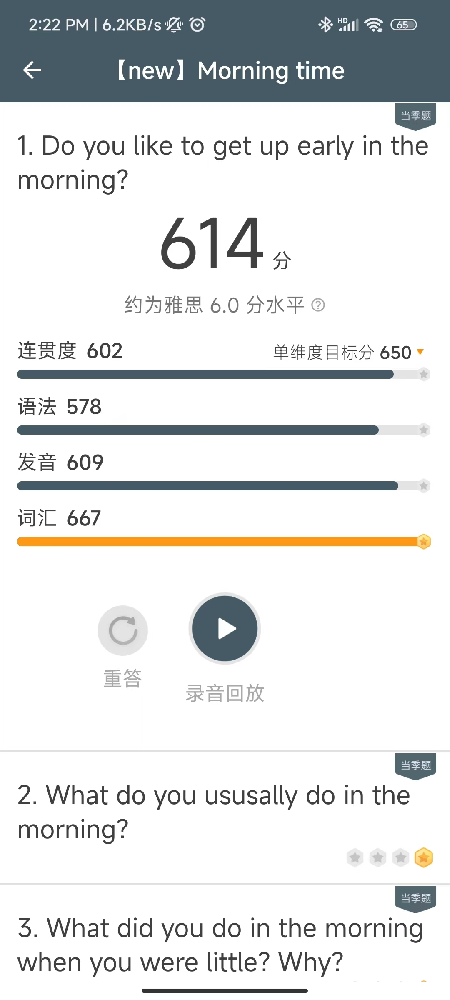
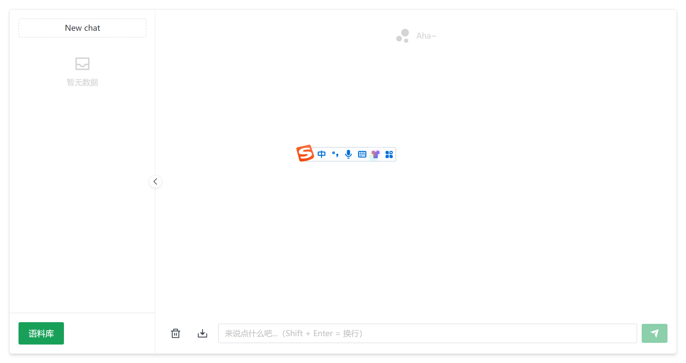

# IELTS-Guide

本项目为雅思复习规划指导，以及资料分享，根据考试内容主要分为四个部分给出建议。

一些原则：

- 推荐机考。多习惯在电脑上打字和无纸化学习
- 多练习，做一些对提高分数真的有用的事情。
- 词汇7000以上就不要背单词，在文段中理解即可。
- 根据要考的分数，合理安排具体复习时间。

需要的网站和工具：

- 同桌英语，模拟机考
- 微软爱写作，练习写作
- 英语流利说app，练习口语
- 流利说雅思app，练习题库加录音提升
- http://ask.questo.chat/，AI问答老师，在线提升。

## 听力

- 每天在同桌英语真题练习真题一套（4个听力）
- 在雅思听力小程序上刷王陆语料库单词，几个重点chapter来回刷2-3遍就可
- 听力过程一定要注意提前抢时间看题，因为录音只播放一遍
- 小错误不要犯，更不要不在意，错了一定要纠正！
- 真正有用的提升事情：对于听力错了4个以上问题的文段，精听默写，把文段所有的内容听写下来，包括标点符号。过程很辛苦，但是提升很明显。
- part1、part2可以作为口语素材，千万不要浪费！其他部分的地道表达也要积累

## 阅读

- 同桌英语每天真题做一套，前期可以不注重时间，后面一定要掐时间
- 如果实在不知道怎么做，需要短期提高，可以看下刘洪波老师B站的阅读课
- 有一定的基础，直接真题反复做，享受阅读的乐趣
- 阅读题只能分为主干题和细节题，具体原因自己领悟
- 积累下老外地道的行文套路，和一些sophisticated1的词句，在写作部分用出来会很惊艳！

## 口语

- 流利说懂你A+，每天学习1~2小时，等级刷到A6-A7，大概口语考分就是6分
- 积累一下回答的思路，怎么样扩充句子，怎么样把事情说清楚。
- 流利说-雅思APP上有当季题库，直接对着说，评分刷到自己需要的分数以上，自动给出四个方面的评分，针对性提高，非常好用！！！
- 
- 考前某宝买真人陪练，3次够了，主要是为了熟悉轻松的跟陌生老外说话的感觉，到考场就不紧张了
- 说话就是说话，不要别扭，正常说就行，考官都是很好的

## 写作

- 推荐B站刘洪波老师写作课
- 推荐刘老师的书《最简化雅思写作指南》一本就够了
- 在微软爱写作上练习20篇大作文，10篇小作文，给出的成绩需在8以上
- 因为微软爱写作没有你的题目，但是写作主要就是根据话题清晰表达你的思想，所以实际考试在6。5-7.5之间
- 针对性的改进提升方式为，询问AI老师，强烈推荐http://ask.questo.chat/，问答网站，首先访问主页
- 
- 然后点击左下角语料库
- 
- 然后点击Filters里面的英语标签
- 
- 选择自己需要的文章润色或口语对话或地道翻译，点击复制
- 举个例子：如使用英语文章润色，点击复制，自动转到聊天页面，根据提示输入聊天即可。
- 
- 师傅领进门，修行靠个人，以此结束当前分享，共勉！

